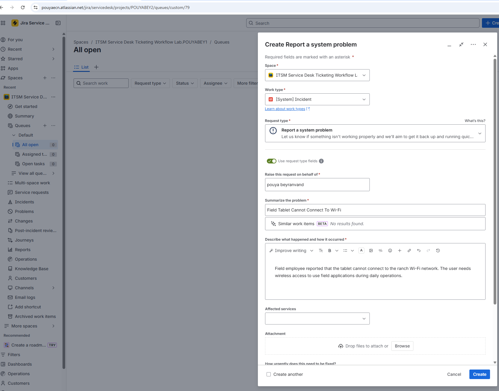
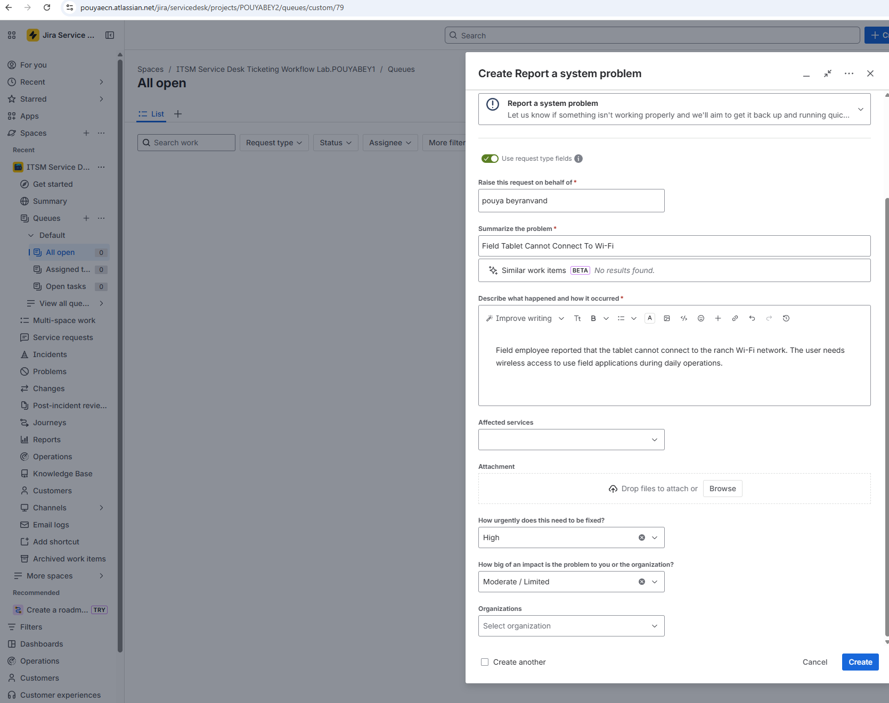
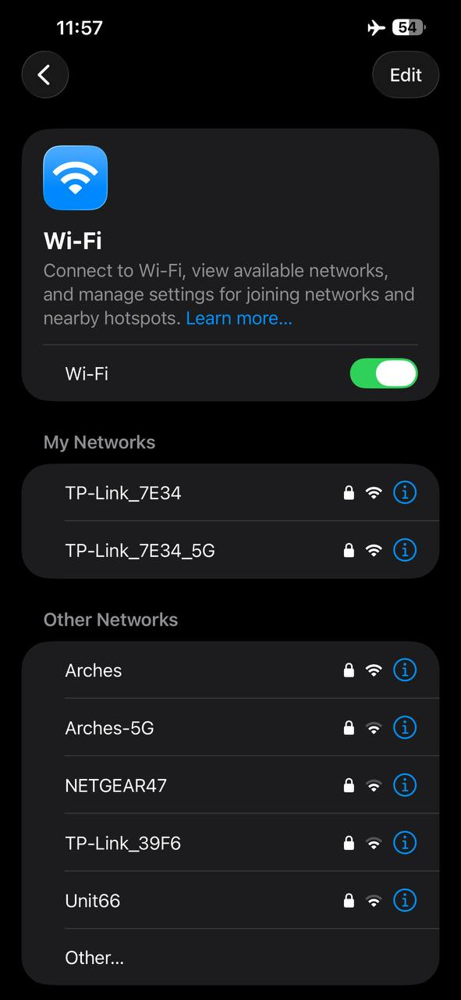
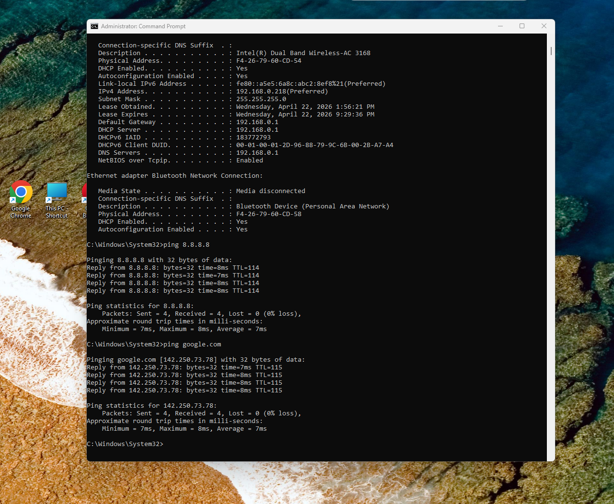
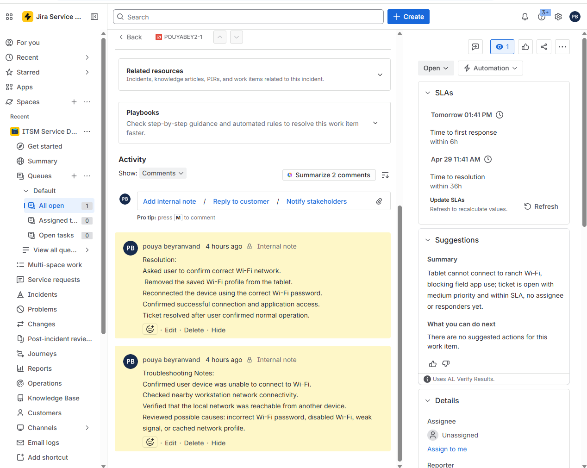

# Ticket 01: Field Tablet Cannot Connect to Wi-Fi

## User Report

A field employee reported that their tablet could not connect to the ranch Wi-Fi network. The user needed wireless access to use field applications during daily operations.

## Ticket Details

| Field | Value |
|---|---|
| Ticket Type | Incident |
| Category | Network / Endpoint Support |
| Priority | High |
| Status | Resolved |
| Affected Device | Field tablet |
| Business Impact | User could not access field applications |

## Initial Symptoms

- Tablet could not connect to Wi-Fi
- User was unable to access field applications
- Issue affected field productivity
- Possible causes included incorrect Wi-Fi password, weak signal, disabled Wi-Fi, or cached network profile

## Troubleshooting Steps

### 1. Ticket Created

The issue was logged in the ITSM system and categorized as a high-priority network/endpoint support incident.




### 2. Wi-Fi Settings Reviewed

The iphone Wi-Fi settings were reviewed to confirm whether the device was connected to the correct wireless network.



### 3. Network Connectivity Validated

A nearby workstation was used to confirm that the local network was working. Basic network commands were used to validate connectivity.

```cmd
ipconfig /all
ping 8.8.8.8
ping google.com
```



### 4. Troubleshooting And Resolution Notes Added

* Troubleshooting notes were added to the ticket to document the investigation process.
* Confirmed the correct Wi-Fi network with the user
* Removed the saved Wi-Fi profile from the tablet
* Reconnected using the correct Wi-Fi password
* Confirmed successful wireless connection
* Verified that the user could access required field applications



