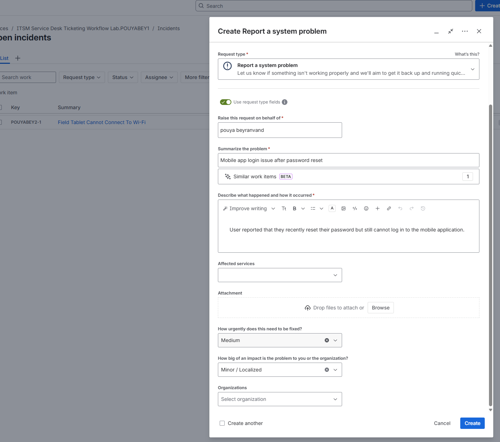
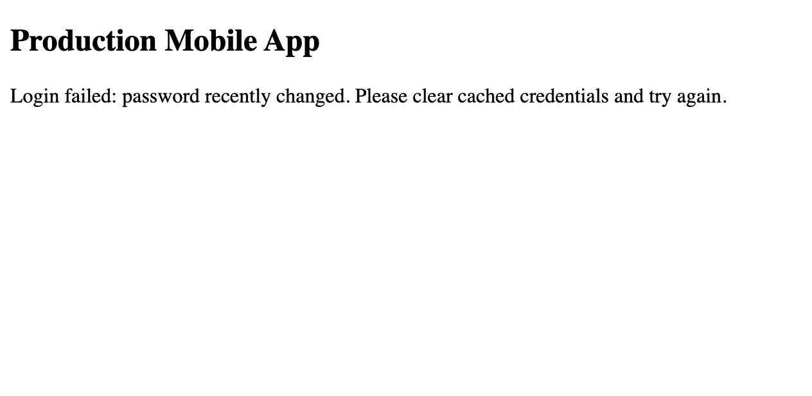
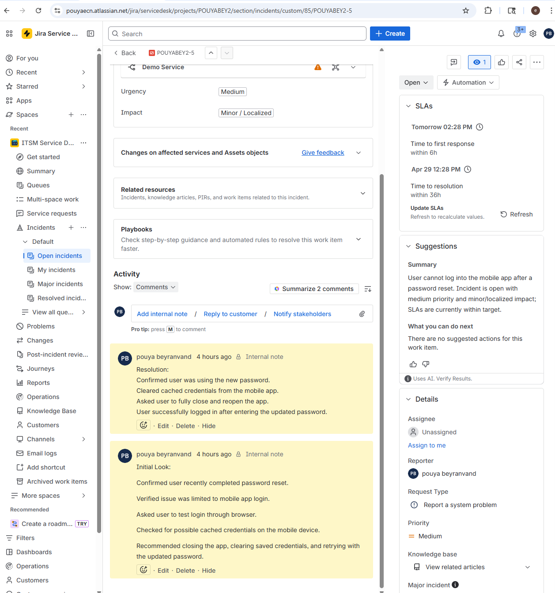

# Ticket 02: Mobile App Login Issue After Password Reset

## User Report

The user reported that they could not log in to the mobile application after recently resetting their password.

## Ticket Details

| Field | Value |
|---|---|
| Ticket Type | Incident |
| Category | Account Access / Application Support |
| Priority | Medium |
| Status | Resolved |
| Affected Service | Mobile application |
| Business Impact | User could not access required mobile app features |

## Initial Symptoms

- User recently reset their password
- Mobile app login failed
- User was unsure whether the issue was related to the password reset or the mobile app
- Possible cached credentials on the mobile device

## Troubleshooting Steps

### 1. Ticket Created

The issue was logged in the ITSM system and categorized as an account access/application support incident.

### 2. Login Error Reviewed

A login error was reproduced using a mock mobile application login page to represent the user-reported issue.
This screenshot was created by me using HTML to make the ticket documentation more complete.

### 3. Initial Look and Resolution Documented

The troubleshooting process focused on verifying whether the issue was caused by cached credentials, incorrect password use, or a mobile app authentication delay.
- Confirmed that the user was using the updated password
- Asked the user to close and reopen the mobile app
- Cleared saved credentials from the mobile device
- Retried login with the new password
- User confirmed successful login

## Root Cause

The most likely cause was cached credentials stored by the mobile application after the password reset.

## Final Ticket Note

The mobile app login issue was resolved after clearing cached credentials and confirming that the user was signing in with the updated password.

