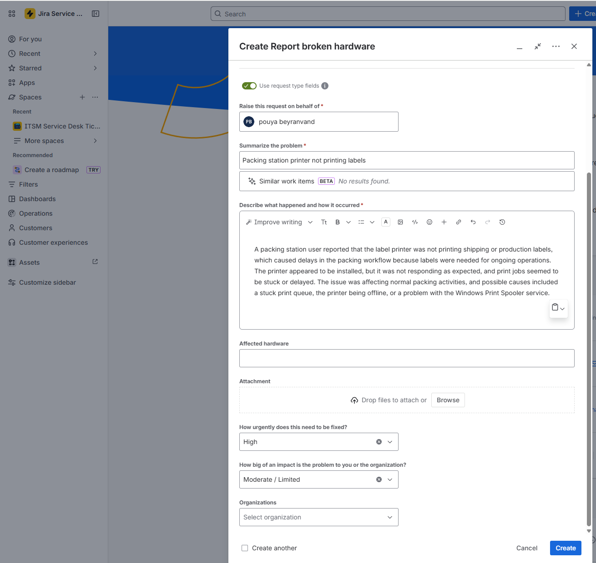
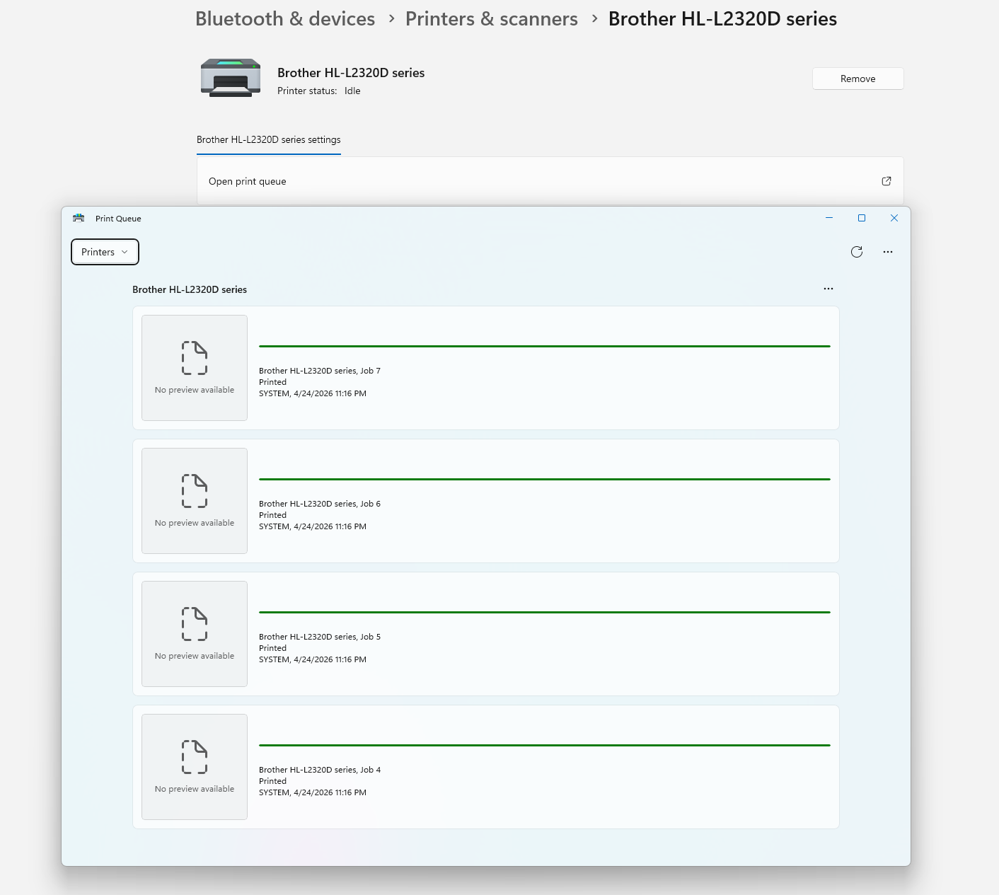
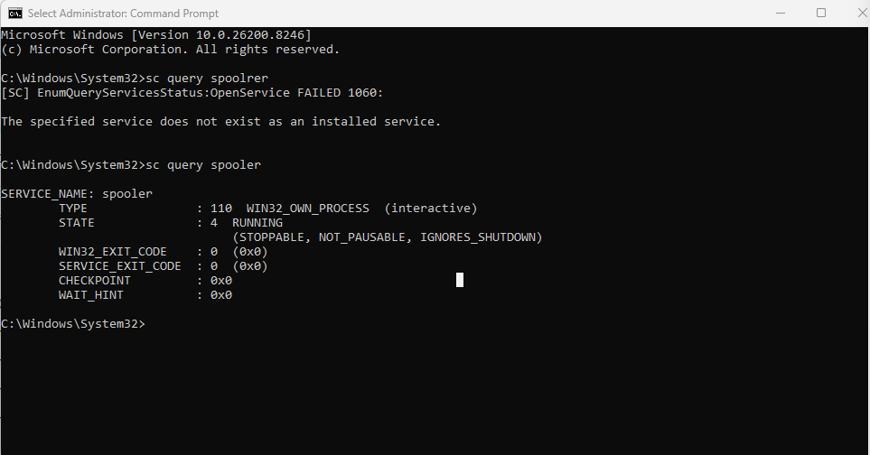
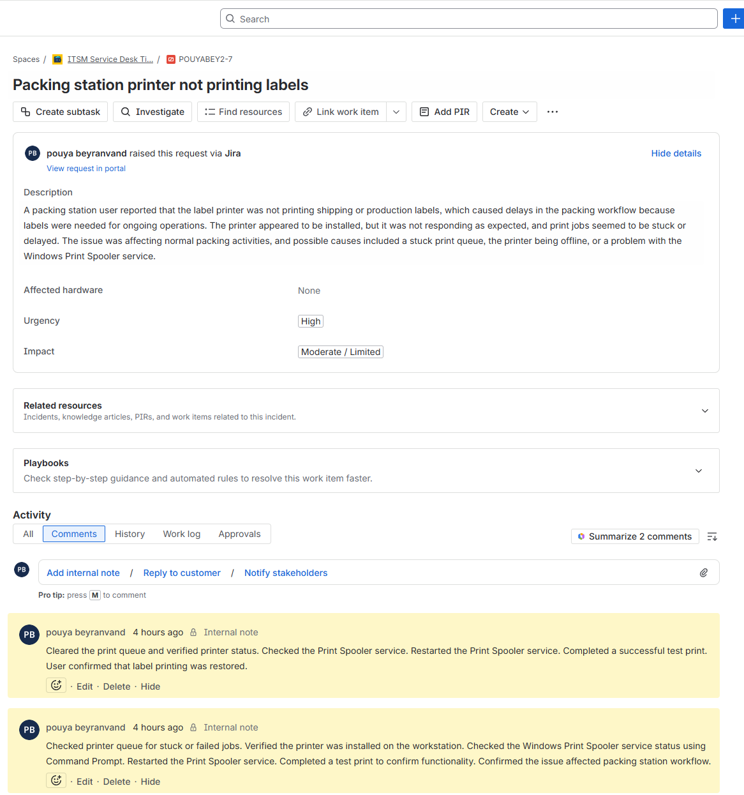

# Ticket 03: Packing Station Printer Not Printing Labels

## User Report

A packing station user reported that the label printer was not printing shipping or production labels.

## Ticket Details

| Field | Value |
|---|---|
| Ticket Type | Incident |
| Category | Printer / Operations Support |
| Priority | High |
| Status | Resolved |
| Affected Device | Packing station label printer |
| Business Impact | Packing workflow delayed because labels could not be printed |

## Initial Symptoms

- Label printer was installed but not printing.
- Print jobs appeared delayed or stuck.
- Packing station workflow was affected.
- Possible causes included a stuck print queue, printer offline status, or Print Spooler service issue.

## Troubleshooting Steps

### 1. Ticket Created

The issue was logged as a high-priority printer support incident because it affected packing station operations.



### 2. Printer Queue Reviewed

The printer queue was reviewed to check for stuck or failed print jobs.



### 3. Print Spooler Status Checked

The Windows Print Spooler service was checked using Command Prompt.

```cmd
sc query spooler
```


### 4. Print Spooler Restarted

The Print Spooler service was restarted to clear possible print processing issues.
```
net stop spooler
net start spooler
```
### 5. Test Print Completed

A test print was completed to confirm that printing functionality was restored.

### Root Cause and Resolution

The most likely cause was a stuck print job or Print Spooler issue preventing label jobs from completing.
* Reviewed printer queue
* Verified printer status
* Checked Print Spooler service status
* Restarted Print Spooler
* Completed successful test print
* Confirmed that printing functionality was restored




### Final Ticket Note

The packing station label printer issue was resolved by reviewing the print queue, checking the Windows Print Spooler service, and completing a successful test print. This confirmed that printing functionality was restored.


